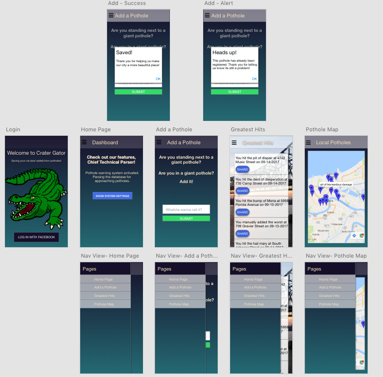
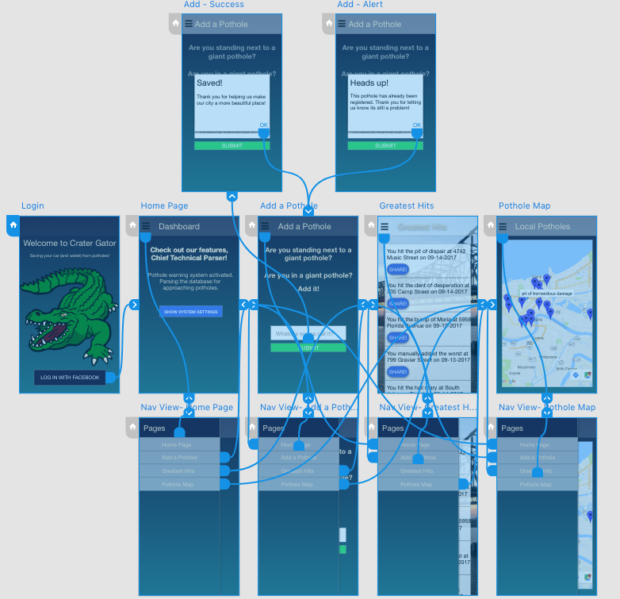
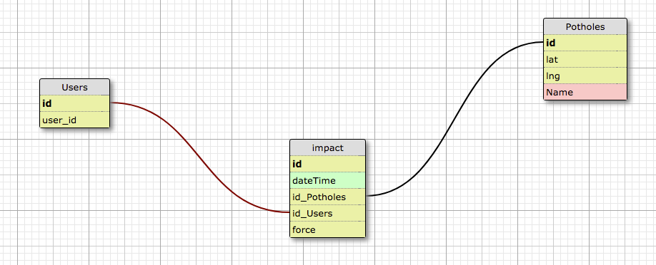

# Crater Gator

> Save your car (and wallet) from New Orleans roads.

## Team

  - __Product Owner__: Marina McGrath
  - __Scrum Master__: Jacques Metevier

## Table of Contents

1. [Team](#team)
1. [About](#about)
1. [Usage](#Usage)
1. [Wireframe](#wireframe)
1. [Tech Stack](#tech-stack)
1. [Schema](#schema)
1. [Contributing](#contributing)

## About
Would you rather find out about potholes before or after you hit them? Well then you need Crater Gator! It uses the patented Pothole Parser TM to warn you of upcoming potholes so you can slow down or change lanes before you hit them. In addition, if you hit a pothole that's not in the database,it's added automatically. Then you can share it with your friends, Facebook, and even the mayor.

Or do you have a pothole the size of a pond on your street? You can add it even without having to drive through it! And you can add an image to show the world just how bad it is.

Want to see all the potholes in the city? Check out the Pothole Map for a bird's eye view of all the cities killer potholes.

## Usage

1. NPM Install
2. NPM Start to run locally

## Wireframe

## Tech Stack

## Schema

## Contributing
See [CONTRIBUTING.md](CONTRIBUTING.md) for contribution guidelines.

